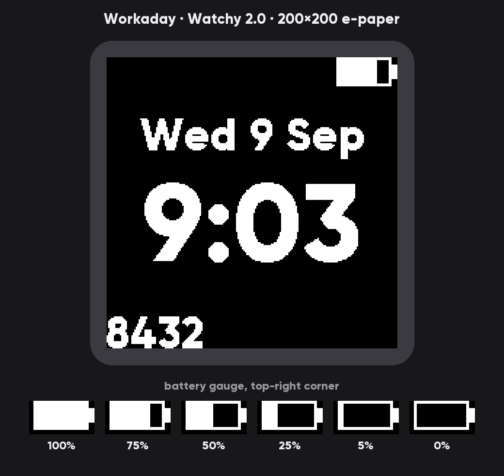
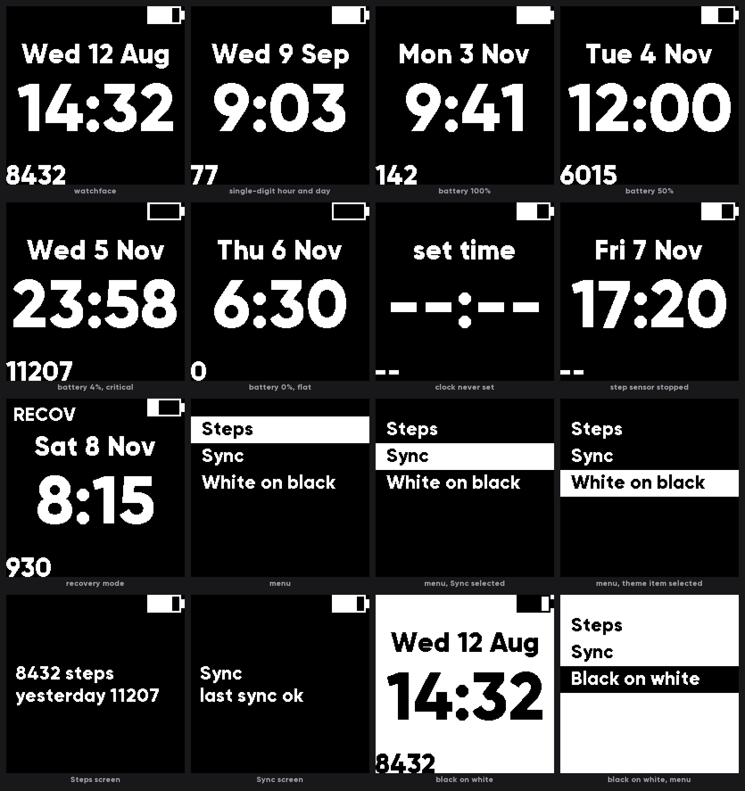

# Workaday — Watchy 2.0 firmware

Firmware for the **SQFMI Watchy v2.0** (ESP32-PICO-D4, 200×200 e-paper, PCF8563
RTC, BMA423 accelerometer, 200 mAh LiPo). Deliberately **not** portable to other
Watchy revisions.

## The face



Gilroy ExtraBold throughout, white on black — or black on white, from the third
menu item, which states which way round it currently is rather than what pressing
it would do. The charge is a gauge in the top-right corner rather than a
percentage, the step count is digits alone in the bottom-left, and neither the
hour nor the day carries a leading zero.

The two corner readings sit *on* the corners rather than a margin inside them,
and the clock is sized to the panel rather than to a taste: at its widest minute
of the day, 20:00, it inks 198 of the 200 columns. That is the largest whole-pixel
size that does not run off the glass — the next one up overshoots by three columns.

Every state the panel can be put into, including the ones that are awkward to
reach on a wrist — a flat cell, a clock that has never been set, a step sensor
that has stopped answering, Recovery mode:



Neither image is a photograph, and neither is a mock-up.
[`tools/preview_face.py`](tools/preview_face.py) reads the generated font header
and the layout constants out of [`src/board/display.cpp`](src/board/display.cpp),
then walks Adafruit GFX's own glyph blitting and text-bounds arithmetic — what is
above is the framebuffer the panel would be handed. Rebuild both in the same
commit as any layout change, or the repository is showing a watch that no longer
exists:

```bash
python tools/preview_face.py --all
```

## Getting started

Requires [PlatformIO](https://platformio.org/install) and VS Code with the
PlatformIO IDE extension. Open this folder; PlatformIO resolves the toolchain and
libraries on first build.

```bash
pio test -e native
```

```bash
pio run -e watchy_v20
```

```bash
pio run -e watchy_v20 -t upload
```

Host tests need only a C++17 compiler — no hardware, no board attached.

On Windows, [`flash.bat`](flash.bat) wraps that last command: it finds PlatformIO
even when only the VS Code extension installed it, takes an optional `COM7` when
the port guess is wrong, and can run the host gate first or stay in the serial
monitor afterwards — `flash.bat test COM7 monitor`. It calls the same `pio`, so
there is nothing in it that the three commands above do not already do.

## What makes this firmware what it is

Five non-negotiable rules, spelled out in [CLAUDE.md](CLAUDE.md):

1. **Energy first.** Deep sleep is the control flow, not an afterthought. No
   `loop()`, no `delay()`, no spin loops. Peripherals off unless in use, enforced
   by RAII guards rather than discipline. Budget: [docs/power-budget.md](docs/power-budget.md).
2. **Never hang.** Watchdog armed on every wake, timeouts on every hardware call,
   a timer backstop behind the RTC alarm, and cross-boot fault escalation into
   Safe and Recovery modes so a crash loop degrades instead of flattening the
   battery in five hours.
3. **Logic is host-tested.** `src/core/**` is pure C++17 with no hardware headers,
   covered by 327 Unity tests running on the developer's machine.
4. **VS Code + PlatformIO out of the box.** Pinned platform, pinned dependencies.
5. **Watchy 2.0 only.** No revision `#if`s, no abstraction for hypothetical
   hardware.

## Layout

```
src/core/     pure logic — decisions, host-tested, no hardware headers
src/board/    Watchy 2.0 hardware access — effects, thin, no policy
src/app/      screen composition and rendering
test/         one Unity suite per core module
tools/        font generation and the desktop preview; fonts/ holds the TTF
docs/         hardware reference, power budget, architecture, review checklist
docs/preview/ the renders above — generated, not drawn
.claude/      the two-agent development workflow
```

The `core`/`board` split is the load-bearing decision: **decisions live in
`core/`, effects in `board/`.** Because the expensive choices (power up the ADC?
refresh the panel? enter Safe mode?) are pure functions of state, they are all
unit-testable — no current probe required to answer "does a button wake spin up
the accelerometer?".

## Development workflow

Two subagents with deliberately asymmetric powers: a **coder** that writes code
and tests, and a **reviewer** that audits and **cannot edit**. Full rationale in
[docs/workflow.md](docs/workflow.md).

| Command | Does |
|---|---|
| `/feature <what to build>` | coder → reviewer → coder, until approved (max 3 rounds) |
| `/review [files]` | Audit only, no fixes |
| `/power-audit` | Whole-firmware energy audit |

## Hardware notes

[docs/hardware-v2.0.md](docs/hardware-v2.0.md) has the verified pin map and the
traps. The ones that bite hardest:

- Buttons are **active HIGH**; sleep wake is `ESP_EXT1_WAKEUP_ANY_HIGH`.
- The RTC interrupt is **active LOW** on `ext0`, trigger level 0.
- **GPIO 34 and 35 have no internal pull resistors** — and v2.0 puts the battery
  ADC on 34 and the Up button on 35. `INPUT_PULLUP` there silently does nothing.
- v1.5 uses different pins for both (Up on 32, ADC on 35). Do not copy v1.5 code.
- The PlatformIO `watchy` board defines `ARDUINO_WATCHY`, not
  `ARDUINO_WATCHY_V20`; the revision is pinned in `platformio.ini` and
  `board_v20.h` `#error`s without it.

## Status

Runs end to end on a real Watchy 2.0: wake → classify → plan → read RTC → read
steps → decide refresh → draw → sleep, with health escalation and the timer
backstop in place. The clock is set from the companion app over BLE — one window
an hour, to [PROTOCOL.md](../PROTOCOL.md) — so a fresh board does not sit at
`--:--`. Daily step counting is implemented against the BMA423's hardware counter
and costs no extra wakes.

See [docs/backlog.md](docs/backlog.md) for what is not built yet: setting the time
on the watch alone, without a phone; vibration alerts; bonding and encryption on
the BLE link. WiFi and NTP are not planned — the phone already knows both the time
and the timezone, and BLE buys the same sync for about a third of the charge.

The power figures are still engineering estimates: running on hardware is not the
same as having been measured on it, and until a meter has been on the rail the ⚠
rows in [docs/power-budget.md](docs/power-budget.md) stand as arithmetic rather
than as fact. A week on a charge says the watch sleeps; it does not say what it
costs, because the capacity it was drawn from is itself unverified.
